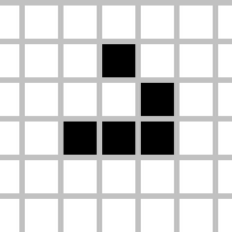

It is a simulation or cellular automaton where it's a giant grid with a bunch of cells inside of it and there is some initial starting state and there's some rules at which these cells will either populate or die and depending on where you place the cells at the start you will get different results
## Rules

1. Any live cell with fewer than two live neighbours dies, as if by underpopulation.

2. Any live cell with more than three live neighbours dies, as if by overpopulation.

3. Any live cell with two or three live neighbours lives on to the next generation.//we wont need to do any thing

4. Any dead cell with exactly three live neighbours becomes a live cell, as if by reproduction.

## Demo

  
You can see every pattern in [here]()
